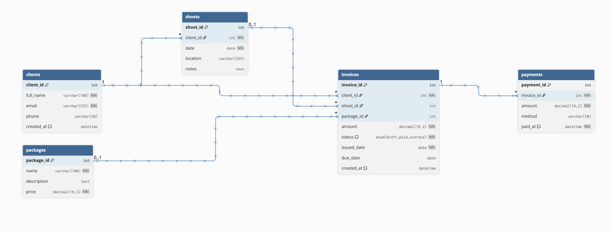

# Photo Client Manager API

A simple API built with FastAPI and MySQL to manage clients, shoots, packages, invoices, and payments for photography work. It is designed as a clean, functional, and scalable solution for managing day-to-day client and job data.

---

## Features
- Client management with unique email validation
- Shoot creation and tracking
- Package linking for invoices
- Invoice management with status tracking (draft, paid, overdue)
- Payment logging and balance calculation
- Reporting endpoint for invoices and balances
- Interactive API documentation via Swagger at `/docs`

---

## Database Structure

Here’s the ERD diagram for the Photo Client Manager API:

---

## Installation & Setup
- Please refer to INSTALLATION.md

## Deployment RAILWAY
- Please refer to DEPLOYMENT_RAILWAY.md

## License

This project is licensed under the MIT License - see the [LICENCE](LICENCE) file for details.

## Copyright

© 2025 Cameron Oliva. All rights reserved.

